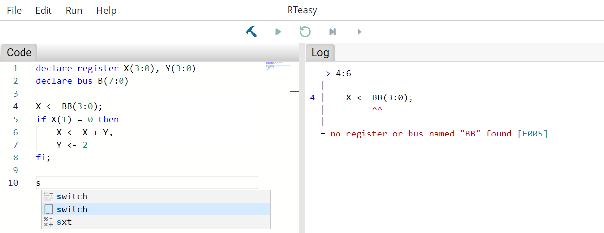

# Editing Mode

At the top you can see the toolbar. With File and Edit classic IDE functions like loading/saving the file or undo/redo can be done. Under Run you can find the same functionality that is available in the second row in the center of the screen. The first button switches between the two modes. The remaining four are used to control the simulation and are disabled in edit mode.

Besides syntax highlighting, the code editor supports autocompletion and code snippets for frequently used constructs like switch-case operations. At the same time, all errors, if any, are displayed live on the right side.

Each error is associated with an error code that can be clicked and leads to the [compiler error index](../../compiler-error-index/errors.md) that explains the errors in more detail.

---

